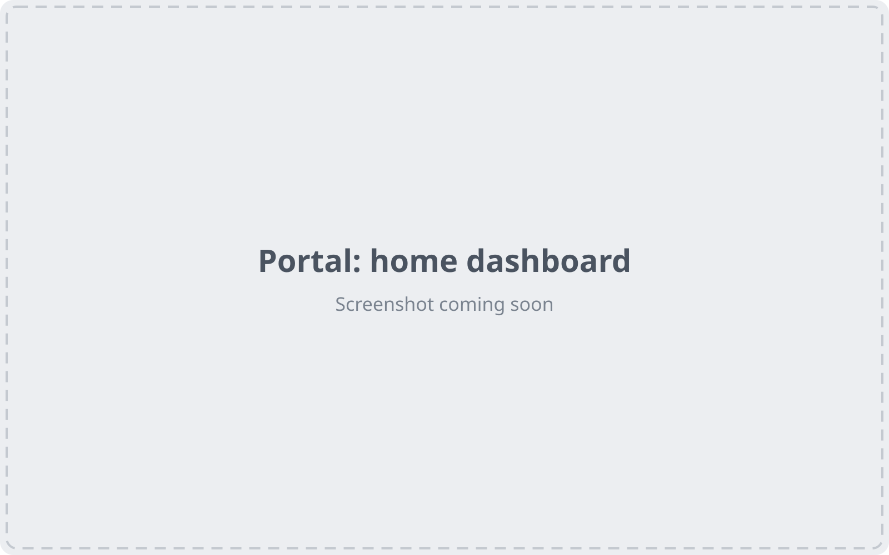
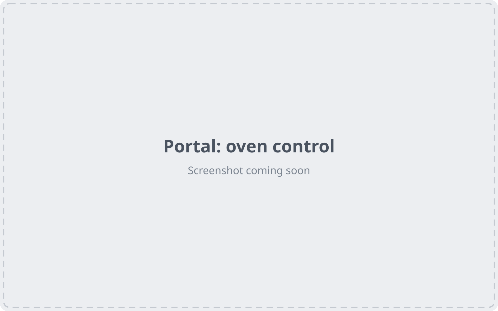
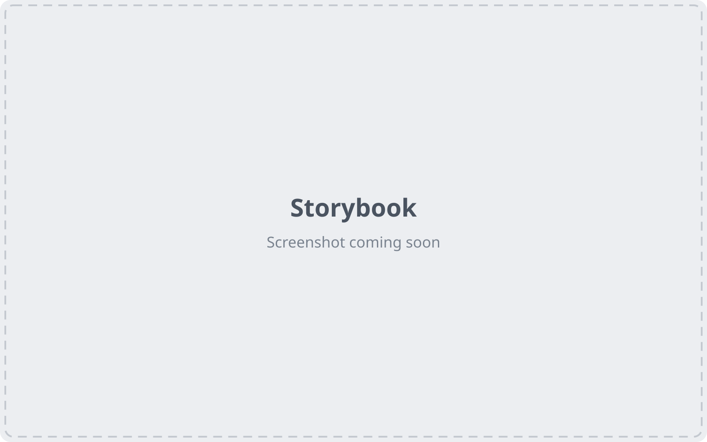

# AldraHome

A smart-home portal for controlling connected appliances, built with React and shadcn/ui.

> Aldra Home is a **fictional brand** made for this project.

🔗 **Portal:** _add link_ · **Storybook:** _add link_

## 🏠 About

Aldra Home is a web app where you check on and control the appliances in your home from one place. Users can:

- See all appliances at a glance, with live status, alerts and a weekly energy chart
- Control the oven: set the temperature with a dial, choose a cooking mode and run a timer
- Control the washer: pick a wash program, set the spin speed and track progress
- Add an appliance, read notifications and get toast feedback
- Switch between light and dark mode

It works on desktop and mobile. The UI components are documented in Storybook.

<!-- Replace placeholders with real PNGs: docs/screenshots/*.png -->

## 📸 Screenshots

### Portal





### Storybook



## 🧰 Stack

- ⚛️ React 19
- 🟦 TypeScript
- 🧩 shadcn/ui on Radix UI
- 🎨 Tailwind CSS v4
- 🎟️ W3C DTCG design tokens built with Style Dictionary
- 📚 Storybook 10
- 📊 Recharts (shadcn/ui charts)
- ✏️ Lucide icons
- ⚡ Vite
- ♿ axe accessibility testing
- ☁️ Cloudflare Pages
- 🤖 AI assisted with Claude Code and Claude Cowork

## 🚀 Run locally

```bash
npm install
npm run tokens      # build tokens + contrast audit
npm run storybook   # http://localhost:6006
npm run dev         # http://localhost:5173
```

## ☁️ Deploy (Cloudflare Pages)

| | Build command | Output directory |
| --- | --- | --- |
| Storybook | `npm run build-storybook` | `design-system/storybook-static` |
| Portal | `npm run build` | `portal/dist` |

Set `NODE_VERSION=22`. If this repo sits inside a parent folder, set the root directory to `web`.

## 👋 Author

**Kamil**, frontend developer & creative coder [kamilpixel.com](https://kamilpixel.com)
